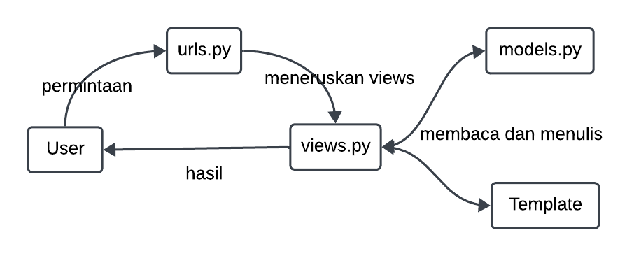

**#Jelaskan bagaimana cara kamu mengimplementasikan checklist di atas secara step-by-step (bukan hanya sekadar mengikuti tutorial).#**
 
Untuk bisa melakukan berbagai operasi yang demikian pertama masuk dalam suatu virtual enviroment untuk mengunduh dan membuat tempat dalam pengembanan web dengan menggunakan perintah `pip install -r requirements.txt` yang mana `requirements.txt` merupakan file yang berisi list _package_ yang harus diunduh dalam menjalankan suatu proyek django saya menggunakan perintah `django-admin startproject <nama project> .` yang mana merupakan perintah default untuk menyusun struktur utama suatu aplikasi berbasis django. lalu untuk dapat menyusun susunan web yang rapi saya membuat suatu _folder_ dengan nama _main_ yang mana berisi aplikasi utama dari django, dimana didapatkan dengan menggunakan perintah `python manage.py startapp main`. Lalu untuk membuat struktur pada web, saya membuat suatu _folder_ bernama _template_ yang berisi suatu _file_ bernama main.html yang mana struktur html dari web django ini. Lalu untuk bisa mengaplikasikan MVT data dibuat menjadi tidak statis dengan memanggil variabel `app_name`, `name` dan `class`. 

Lalu agar data pada variabel yang akan dipanggil pada main.html maka kita perlu membuat definisi masing-masing variabel tersebut dengan membuat suatu fungsi bernama `show_main` pada views.py yang mana mendefinisikan nilai `app_name`, `name`, dan `class`, lalu mengembalikkan solusi dengan secara spesifik menuju pada laman main.html, lalu agar aplikasi dapat terimplementasi dengan baik kita harus melakukan proses _routing_ dan pemberian hak akses pada beberapa hal. Pertama agar _folder_ main dapat digunakan maka kita perlu memasukkan `main` pada `INSTALLED_APPS` pada settings.py yang berada pada folder utama. Lalu agar MVT dapat terjadi maka diperlukan routing fungsi `show_main` dengan menambahkan `path show_main` pada `urlspattern` di _file_ urls.py , Lalu pada _folder_ utama projek saya mengubah _file_ urls.py dengan menambahkan isi dari `urlspattern` dengan menambah _path_ ke `main.urls`. Lalu agar memungkinkan _deploy_ aplikasi pada localhost dan juga pada pws saya menambahkan url atau port yang akan digunakan sebagai sarana _hosting_ . 

Lalu untuk memfasiliatsi pengembangan yang lebih lanjut atau dalam maksud ini _backend_ maka saya membuat model pada _file_ models.py dimana berisi atribut `name`, `price` dan `description`. Lalu untuk mengintegrasikan seluruh model yang baru didefinisikan saya menggunkan perintah `python manage.py makemigrations`. Lalu setelah melakukan perubahan untuk seluruh kode yang diperlukan kita lakukan _commit_ menuju github dengan melakukan operasi `git add .`, `git commit -m "comment"`, `git push`.
---

**Buatlah bagan yang berisi request client ke web aplikasi berbasis Django beserta responnya dan jelaskan pada bagan tersebut kaitan antara urls.py, views.py, models.py, dan berkas html.**

---

**Jelaskan fungsi git dalam pengembangan perangkat lunak!**
Git dalam perangkat lunak berfungsi untuk melakukan penyimpanan perubahan atau tiap versi dalam pengembangan suatu aplikasi, sehingga kita masih memiliki simpanan dari berbagai perubahan yang dilakukan. Selain itu, git juga dapat membantu dalam melakukan kolaborasi dalam pengembangan suatu aplikasi dimana tiap pengembang dapat di-_track_ dan dapat dengan mudah melihat perubahan yang dilakukan oleh orang lain.
---

**Menurut Anda, dari semua framework yang ada, mengapa framework Django dijadikan permulaan pembelajaran pengembangan perangkat lunak?**
a. Full-Stack Framework yang Terstruktur
Django adalah full-stack framework, yang berarti ia menyediakan alat untuk semua bagian dari aplikasi web, mulai dari frontend hingga backend. Ini termasuk routing, manajemen database, authentication, hingga keamanan. Pemula yang belajar Django bisa memahami cara kerja aplikasi secara menyeluruh tanpa harus menggunakan banyak alat atau framework lain.

b. Pendekatan Batteries Included
Django mengikuti filosofi batteries included, yang berarti framework ini sudah dilengkapi dengan fitur-fitur dasar yang dibutuhkan untuk membangun aplikasi web. Ini memudahkan pemula karena mereka tidak perlu mengonfigurasi terlalu banyak komponen eksternal. Contoh fiturnya meliputi ORM (Object-Relational Mapping), sistem manajemen admin, otentikasi pengguna, dan sistem templating yang kuat.

c. ORM yang Memudahkan Pengelolaan Database
Django memiliki ORM bawaan yang memungkinkan pengembang untuk bekerja dengan database tanpa harus menulis banyak kode SQL. Ini sangat membantu pemula, karena mereka dapat fokus pada logika aplikasi dan belajar manajemen database dengan cara yang lebih intuitif dan user-friendly.

d. Dokumentasi yang Lengkap dan Komunitas yang Aktif
Django dikenal memiliki dokumentasi yang sangat komprehensif dan jelas. Ini sangat penting untuk pembelajaran, karena pemula bisa mendapatkan panduan yang jelas tentang bagaimana menggunakan setiap fitur. Selain itu, komunitas Django juga sangat aktif, sehingga pemula dapat dengan mudah menemukan tutorial, forum, dan contoh kasus dari pengembang lain.

e. Fokus pada Praktik Best Practices
Django dirancang dengan prinsip-prinsip best practices dalam pengembangan perangkat lunak, seperti keamanan (CSRF protection, SQL injection protection), skema URL yang bersih, serta penggunaan arsitektur Model-View-Template (MVT). Penggunaan Django membantu pemula memahami pentingnya struktur yang baik dan kode yang teratur sejak awal pembelajaran.

f. Keamanan Bawaan yang Tinggi
Django secara otomatis mengimplementasikan banyak langkah keamanan dasar, seperti perlindungan terhadap serangan SQL Injection, Cross-Site Scripting (XSS), dan Cross-Site Request Forgery (CSRF). Ini memberi pengembang pemula keamanan dasar tanpa harus memahaminya secara mendalam dari awal.

g. Kemudahan Skalabilitas
Django adalah framework yang sering digunakan oleh startup hingga perusahaan besar, seperti Instagram dan Pinterest, karena mampu menangani aplikasi yang skalanya besar. Mempelajari Django memberikan pemahaman kepada pemula bahwa framework ini dapat digunakan untuk proyek kecil hingga besar, dan mereka tidak perlu mengganti framework ketika proyek mereka berkembang.

h. Sesuai untuk Pengembangan Cepat
Django memudahkan pengembangan prototipe dengan cepat karena berbagai alat yang sudah terintegrasi. Pengembang pemula dapat melihat hasil dari kode mereka lebih cepat, yang membantu mereka tetap termotivasi dalam proses pembelajaran.

i. Dukungan Terhadap REST API dan Teknologi Modern
Django sangat mendukung pengembangan REST API dengan Django REST Framework (DRF). Hal ini memberi kesempatan kepada pengembang pemula untuk belajar tentang bagaimana membangun API modern yang berinteraksi dengan berbagai frontend frameworks seperti React, Vue, atau Angular.
---

**Mengapa model pada Django disebut sebagai ORM?**
Model pada Django disebut sebagai ORM (Object-Relational Mapping) karena Django menggunakan pendekatan ini untuk menghubungkan antara objek Python dengan database relasional. ORM memungkinkan pengembang untuk berinteraksi dengan database menggunakan objek-objek Python, tanpa harus menulis SQL secara langsung. Penjelasan lebih lengkap:

a. Objek (Object): Dalam Django, model didefinisikan sebagai kelas Python. Setiap kelas model merepresentasikan tabel di database, dan setiap atribut di kelas tersebut merepresentasikan kolom dalam tabel.

b. Relasional (Relational): Django ORM bekerja dengan database relasional seperti PostgreSQL, MySQL, SQLite, dll. Basis data relasional menyimpan data dalam bentuk tabel yang berhubungan satu sama lain melalui foreign key, primary key, dan relasi lainnya.

c. Mapping: ORM memetakan (mapping) objek di Python (model dan atribut) ke struktur tabel dan kolom di database. Dengan menggunakan ORM, pengembang dapat membuat, membaca, memperbarui, dan menghapus data (operasi CRUD) di database melalui kode Python, tanpa menulis query SQL.