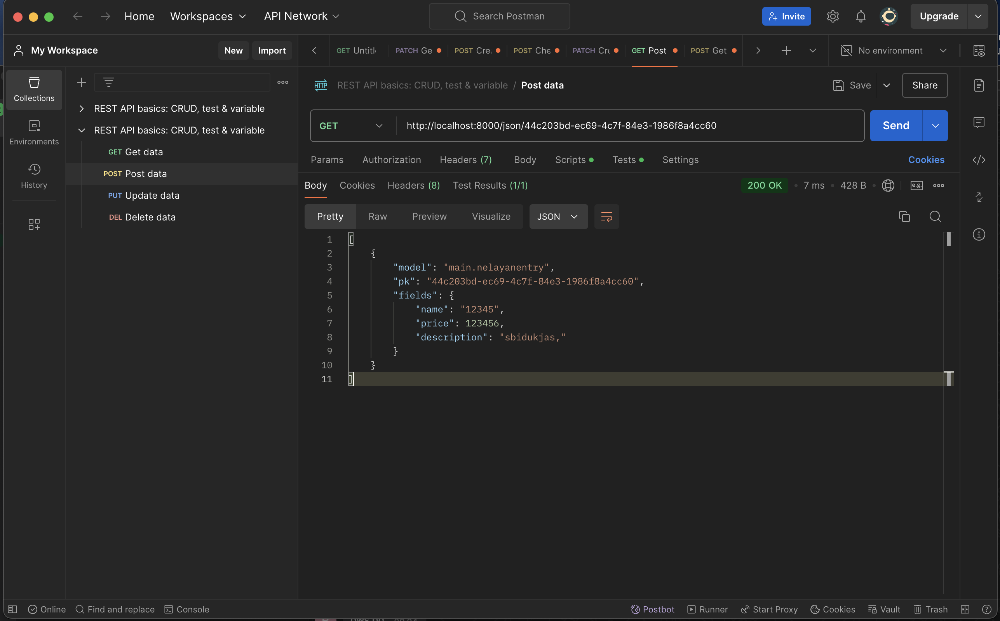

URL KE PWS: http://raihan-akbar-nelayanpastijuragan.pbp.cs.ui.ac.id/


# Tugas 2
### **Jelaskan bagaimana cara kamu mengimplementasikan checklist di atas secara step-by-step (bukan hanya sekadar mengikuti tutorial).**


Untuk bisa melakukan berbagai operasi yang demikian pertama masuk dalam suatu virtual enviroment untuk mengunduh dan membuat tempat dalam pengembanan web dengan menggunakan perintah `pip install -r requirements.txt` yang mana requirements.txt merupakan _file_ yang berisi list _package_ yang harus diunduh dalam menjalankan suatu proyek django saya menggunakan perintah `django-admin startproject -nama project- .` yang mana merupakan perintah default untuk menyusun struktur utama suatu aplikasi berbasis django. lalu untuk dapat menyusun susunan web yang rapi saya membuat suatu _folder_ dengan nama _main_ yang mana berisi aplikasi utama dari django, dimana didapatkan dengan menggunakan perintah `python manage.py startapp main`. Lalu untuk membuat struktur pada web, saya membuat suatu _folder_ bernama _template_ yang berisi suatu _file_ bernama main.html yang mana struktur html dari web django ini. Lalu untuk bisa mengaplikasikan MVT data dibuat menjadi tidak statis dengan memanggil variabel `app_name`, `name` dan `class`. 


Lalu agar data pada variabel yang akan dipanggil pada main.html maka kita perlu membuat definisi masing-masing variabel tersebut dengan membuat suatu fungsi bernama `show_main` pada views.py yang mana mendefinisikan nilai `app_name`, `name`, dan `class`, lalu mengembalikkan solusi dengan secara spesifik menuju pada laman main.html, lalu agar aplikasi dapat terimplementasi dengan baik kita harus melakukan proses _routing_ dan pemberian hak akses pada beberapa hal. Pertama agar _folder_ main dapat digunakan maka kita perlu memasukkan `main` pada `INSTALLED_APPS` pada settings.py yang berada pada folder utama. Lalu agar MVT dapat terjadi maka diperlukan routing fungsi `show_main` dengan menambahkan path `show_main` pada `urlspattern` di _file_ urls.py , Lalu pada _folder_ utama projek saya mengubah _file_ urls.py dengan menambahkan isi dari `urlspattern` dengan menambah _path_ ke `main.urls`. Lalu agar memungkinkan _deploy_ aplikasi pada localhost dan juga pada pws saya menambahkan url atau port yang akan digunakan sebagai sarana _hosting_ . 


Lalu untuk memfasiliatsi pengembangan yang lebih lanjut atau dalam maksud ini _backend_ maka saya membuat model pada _file_ models.py dimana berisi atribut `name`, `price` dan `description`. Lalu untuk mengintegrasikan seluruh model yang baru didefinisikan saya menggunkan perintah `python manage.py makemigrations`. Lalu setelah melakukan perubahan untuk seluruh kode yang diperlukan kita lakukan _commit_ menuju github dengan melakukan operasi `git add .`, `git commit -m "comment"`, `git push`.

---

### **Buatlah bagan yang berisi request client ke web aplikasi berbasis Django beserta responnya dan jelaskan pada bagan tersebut kaitan antara urls.py, views.py, models.py, dan berkas html.**


---

### **Jelaskan fungsi git dalam pengembangan perangkat lunak!**
Git dalam perangkat lunak berfungsi untuk melakukan penyimpanan perubahan atau tiap versi dalam pengembangan suatu aplikasi, sehingga kita masih memiliki simpanan dari berbagai perubahan yang dilakukan. Selain itu, git juga dapat membantu dalam melakukan kolaborasi dalam pengembangan suatu aplikasi dimana tiap pengembang dapat di-_track_ dan dapat dengan mudah melihat perubahan yang dilakukan oleh orang lain.

---

### **Menurut Anda, dari semua framework yang ada, mengapa framework Django dijadikan permulaan pembelajaran pengembangan perangkat lunak?**
a. Full-Stack Framework yang Terstruktur
Django adalah full-stack framework, yang berarti ia menyediakan alat untuk semua bagian dari aplikasi web, mulai dari frontend hingga backend. Ini termasuk routing, manajemen database, authentication, hingga keamanan. Pemula yang belajar Django bisa memahami cara kerja aplikasi secara menyeluruh tanpa harus menggunakan banyak alat atau framework lain.

b. Pendekatan Batteries Included
Django mengikuti filosofi batteries included, yang berarti framework ini sudah dilengkapi dengan fitur-fitur dasar yang dibutuhkan untuk membangun aplikasi web. Ini memudahkan pemula karena mereka tidak perlu mengonfigurasi terlalu banyak komponen eksternal. Contoh fiturnya meliputi ORM (Object-Relational Mapping), sistem manajemen admin, otentikasi pengguna, dan sistem templating yang kuat.

c. ORM yang Memudahkan Pengelolaan Database
Django memiliki ORM bawaan yang memungkinkan pengembang untuk bekerja dengan database tanpa harus menulis banyak kode SQL. Ini sangat membantu pemula, karena mereka dapat fokus pada logika aplikasi dan belajar manajemen database dengan cara yang lebih intuitif dan user-friendly.

d. Dokumentasi yang Lengkap dan Komunitas yang Aktif
Django dikenal memiliki dokumentasi yang sangat komprehensif dan jelas. Ini sangat penting untuk pembelajaran, karena pemula bisa mendapatkan panduan yang jelas tentang bagaimana menggunakan setiap fitur. Selain itu, komunitas Django juga sangat aktif, sehingga pemula dapat dengan mudah menemukan tutorial, forum, dan contoh kasus dari pengembang lain.

e. Fokus pada Praktik Best Practices
Django dirancang dengan prinsip-prinsip best practices dalam pengembangan perangkat lunak, seperti keamanan (CSRF protection, SQL injection protection), skema URL yang bersih, serta penggunaan arsitektur Model-View-Template (MVT). Penggunaan Django membantu pemula memahami pentingnya struktur yang baik dan kode yang teratur sejak awal pembelajaran.

f. Keamanan Bawaan yang Tinggi
Django secara otomatis mengimplementasikan banyak langkah keamanan dasar, seperti perlindungan terhadap serangan SQL Injection, Cross-Site Scripting (XSS), dan Cross-Site Request Forgery (CSRF). Ini memberi pengembang pemula keamanan dasar tanpa harus memahaminya secara mendalam dari awal.

g. Kemudahan Skalabilitas
Django adalah framework yang sering digunakan oleh startup hingga perusahaan besar, seperti Instagram dan Pinterest, karena mampu menangani aplikasi yang skalanya besar. Mempelajari Django memberikan pemahaman kepada pemula bahwa framework ini dapat digunakan untuk proyek kecil hingga besar, dan mereka tidak perlu mengganti framework ketika proyek mereka berkembang.

h. Sesuai untuk Pengembangan Cepat
Django memudahkan pengembangan prototipe dengan cepat karena berbagai alat yang sudah terintegrasi. Pengembang pemula dapat melihat hasil dari kode mereka lebih cepat, yang membantu mereka tetap termotivasi dalam proses pembelajaran.

i. Dukungan Terhadap REST API dan Teknologi Modern
Django sangat mendukung pengembangan REST API dengan Django REST Framework (DRF). Hal ini memberi kesempatan kepada pengembang pemula untuk belajar tentang bagaimana membangun API modern yang berinteraksi dengan berbagai frontend frameworks seperti React, Vue, atau Angular.

---

### **Mengapa model pada Django disebut sebagai ORM?**
Model pada Django disebut sebagai ORM (Object-Relational Mapping) karena Django menggunakan pendekatan ini untuk menghubungkan antara objek Python dengan database relasional. ORM memungkinkan pengembang untuk berinteraksi dengan database menggunakan objek-objek Python, tanpa harus menulis SQL secara langsung. Penjelasan lebih lengkap:

a. Objek (Object): Dalam Django, model didefinisikan sebagai kelas Python. Setiap kelas model merepresentasikan tabel di database, dan setiap atribut di kelas tersebut merepresentasikan kolom dalam tabel.

b. Relasional (Relational): Django ORM bekerja dengan database relasional seperti PostgreSQL, MySQL, SQLite, dll. Basis data relasional menyimpan data dalam bentuk tabel yang berhubungan satu sama lain melalui foreign key, primary key, dan relasi lainnya.

c. Mapping: ORM memetakan (mapping) objek di Python (model dan atribut) ke struktur tabel dan kolom di database. Dengan menggunakan ORM, pengembang dapat membuat, membaca, memperbarui, dan menghapus data (operasi CRUD) di database melalui kode Python, tanpa menulis query SQL.

# Tugas 3
### **Jelaskan mengapa kita memerlukan data delivery dalam pengimplementasian sebuah platform?**
Data delivery, atau pengiriman data, adalah proses mendistribusikan informasi dari satu sistem ke sistem lain dalam sebuah platform. Dalam pengembangan suatu aplikasi data delivery sangat penting karena merupakan otak dalam komunikasi dan operasi antara komponen atau pengguna pada platform tersebut. Adapun bila dijabarkan dapat terjelaskan sebagai berikut:

1. Pertukaran Data yang Efisien
Dalam platform apa pun, data harus ditransfer antara berbagai modul, layanan, atau pengguna. Data delivery yang efisien memastikan bahwa informasi dikirimkan dengan cepat, akurat, dan pada waktu yang tepat, sehingga memungkinkan aplikasi berjalan lancar. Tanpa mekanisme data delivery yang andal, data bisa tertahan, terlambat sampai, atau hilang, yang dapat menyebabkan sistem tidak responsif atau tidak bekerja sesuai ekspektasi.

2. Konektivitas Antar-Komponen
Sebagian besar platform memiliki berbagai komponen atau modul yang perlu bekerja bersama untuk memberikan layanan. Misalnya, dalam aplikasi e-commerce, data pesanan, pembayaran, dan stok harus dikomunikasikan secara tepat di antara beberapa sistem (front-end, back-end, database, gateway pembayaran, dll.). Data delivery memungkinkan konektivitas antar-modul ini sehingga semua komponen dapat mengakses dan menggunakan informasi yang sama, menjaga sinkronisasi dan keakuratan data.

3. Pengalaman Pengguna yang Lebih Baik
Pengguna platform modern mengharapkan respon yang cepat dan layanan yang konsisten. Sistem data delivery yang efisien membantu memastikan bahwa pengguna mendapatkan informasi yang diinginkan secara real-time atau mendekati real-time. Misalnya, dalam aplikasi media sosial atau platform layanan streaming, data seperti pesan atau konten video harus dikirimkan segera setelah diminta oleh pengguna. Ini memastikan user experience yang lancar dan memuaskan.

4. Keamanan Data
Sistem pengiriman data yang baik juga memperhatikan keamanan dalam proses pengiriman informasi, terutama ketika data yang ditransfer adalah sensitif (misalnya, informasi pribadi, data pembayaran, dll.). Dengan adanya data delivery yang aman, platform dapat memastikan bahwa data yang dikirimkan antar-sistem tidak mudah diakses atau dimodifikasi oleh pihak yang tidak berwenang. Ini melibatkan enkripsi, otentikasi, dan kontrol akses yang kuat.

5. Replikasi dan Skalabilitas
Dalam platform besar yang mendukung banyak pengguna dan volume data yang tinggi, replikasi data dan skalabilitas sistem menjadi penting. Data delivery memungkinkan platform mendistribusikan data ke berbagai lokasi atau server yang terpisah secara geografis, sehingga platform dapat berfungsi secara efisien di bawah beban yang tinggi. Misalnya, dalam platform global seperti penyedia layanan cloud atau jaringan distribusi konten (CDN), data delivery memungkinkan pengguna di berbagai wilayah menerima layanan dengan latensi minimal.

6. Keandalan dan Redundansi
Data delivery juga memastikan bahwa data yang penting tidak hilang selama transmisi. Dalam platform dengan volume data yang tinggi, keandalan menjadi kunci. Pengiriman data yang baik dapat mencakup mekanisme redundansi, seperti replikasi data atau pengiriman ulang, untuk memastikan bahwa data selalu sampai ke tujuan meskipun terjadi kegagalan jaringan atau sistem.

7. Pengambilan Keputusan Berbasis Data
Platform yang mengandalkan data analytics untuk pengambilan keputusan (misalnya, platform e-commerce yang menggunakan data pengguna untuk personalisasi) membutuhkan data yang dikirim secara cepat dan akurat ke mesin pemrosesan data. Data delivery memastikan bahwa data dikumpulkan dari berbagai titik dalam platform dan dikirim ke sistem analitik dengan cepat untuk menghasilkan wawasan yang berguna.

8. Penghematan Biaya Operasional
Proses pengiriman data yang buruk atau tidak efisien dapat menyebabkan penggunaan sumber daya yang tidak optimal, seperti bandwidth atau server, yang pada akhirnya meningkatkan biaya operasional. Dengan sistem data delivery yang baik, penggunaan sumber daya bisa lebih terkontrol, mengurangi pemborosan dan meningkatkan efisiensi operasional platform.

9. Integrasi dengan Sistem Lain
Banyak platform harus berintegrasi dengan sistem pihak ketiga (misalnya, API dari platform lain, layanan pembayaran, atau penyedia logistik). Data delivery yang andal diperlukan agar platform dapat bertukar data dengan sistem eksternal ini secara mulus, misalnya, dalam sistem ERP atau CRM.

### **Menurutmu, mana yang lebih baik antara XML dan JSON? Mengapa JSON lebih populer dibandingkan XML?**
Bagi saya alasan kepopuleran dari JSON dibanding XML adalah kemudahan dalam membaca data yang ada serta besar berkas yang lebih kecil dibandingkan XML. Sehingga memungkinkan proses _debugging_ yang lebih mudah dan juga proses pertukaran informasi yang lebih efisien

### **Jelaskan fungsi dari method is_valid() pada form Django dan mengapa kita membutuhkan method tersebut?**
Method form.is_valid() dalam Django berfungsi untuk memvalidasi data yang dikirimkan melalui form. Ketika Anda menggunakan form di Django, seperti dalam kasus formulir HTML untuk input data pengguna, validasi sangat penting untuk memastikan bahwa data yang diterima dari pengguna sudah sesuai dengan aturan yang telah ditentukan di dalam form tersebut. Dalam hal ini sebelum data diteruskan ke database telah dicek apakah setiap data yang dimasukkan oleh pengguna telah sesuai dengan format pada models, seperti _price_ haruslah diisi hanya oleh bilangan dan _name_ oleh kalimat dan sebagainya. Sehingga pada akhirnya didapatkan data yang kesannya bersih.

### **Mengapa kita membutuhkan csrf_token saat membuat form di Django? Apa yang dapat terjadi jika kita tidak menambahkan**
**csrf_token pada form Django? Bagaimana hal tersebut dapat dimanfaatkan oleh penyerang?**

**Mengapa Kita Membutuhkan csrf_token di Django?**
CSRF (Cross-Site Request Forgery) adalah jenis serangan di mana penyerang dapat memaksa pengguna untuk melakukan tindakan tidak diinginkan pada situs web tempat mereka sudah terautentikasi. csrf_token adalah mekanisme keamanan yang digunakan Django untuk melindungi aplikasi dari serangan CSRF.

Saat membuat form di Django, kita perlu menambahkan csrf_token untuk mencegah serangan ini. Token ini adalah nilai unik yang dibuat oleh server dan disisipkan dalam setiap form yang mengirimkan data melalui metode POST. Saat form dikirim, Django akan memeriksa apakah token yang dikirimkan dalam request sesuai dengan token yang diharapkan. Jika token tidak cocok atau tidak ada, Django akan menolak request tersebut karena dianggap tidak sah.

**Apa yang Terjadi Jika Tidak Menambahkan csrf_token?**
Jika kita tidak menambahkan csrf_token dalam form Django, aplikasi kita akan rentan terhadap serangan CSRF. Hal ini berarti penyerang bisa memanfaatkan kelemahan ini untuk:
    1. Mengirim permintaan yang tidak sah dari browser korban tanpa sepengetahuan mereka.
    2. Membuat korban tanpa sengaja melakukan tindakan berbahaya seperti mengubah data akun, melakukan transfer uang, atau mengirim data sensitif di aplikasi yang mereka login sebelumnya.
Tanpa csrf_token, aplikasi tidak dapat membedakan antara permintaan yang sah dari pengguna yang valid dan permintaan yang dibuat oleh penyerang. Sebagai contoh semisal penyerang telah mengetahui suatu endpoint yang tak terlindungi oleh csrf, maka apabila ada seorang pengguna yang telah terverfikasi oleh sistem dalam suatu web dan ia mengunjungi suatu halaman web yang telah disisipi kode "jahat", maka penyerang memungkin untuk menerima atau membuat _request_ yang membahayakan data pribadi korban.

### **Jelaskan bagaimana cara kamu mengimplementasikan checklist di atas secara step-by-step (bukan hanya sekadar mengikuti tutorial).**
A. Membuat input form untuk menambahkan objek model pada app sebelumnya.
Pertama tama pada bagian model saya menambahkan _field_ `id` yang didesain untuk menjadi parameter unik yang membedakan suatu data dengan data yang lain
```
id = models.UUIDField(primary_key=True, default=uuid.uuid4, editable=False)
```
Lalu untuk memfasilitasi masukkan dari pengguna saya membuat suatu berkas bernama forms.py yang ditujukan sebagai tempat masukkan dan berkas yang mempermudah proses validasi dari masukkan.
```
from django.forms import ModelForm
from main.models import Product

class ProductForm(ModelForm):
    class Meta:
        model = Product
        fields = ["name", "price", "description"]
```
Lalu pada berkas views.py saya menambahkan suatu fungsi baru yang berisi perintah ketika laman dari form diakses, dimana didalamnya juga dilakukan proses verifikasi dan juga perubahan dalam database apabila data yang dimasukkan ada dan benar.
```
def create_item_entry(request):
    form = ProductForm(request.POST or None)

    if form.is_valid() and request.method == "POST":
        form.save()
        return redirect('main:show_main')
    
    context = {'form': form }
    return render(request, "create_item_entry.html", context)
```
Lalu untuk memastikan laman form dapat diakses maka pada berkas urls.py saya tambahka proses _routing_ untuk laman form.
```
path('create-item-entry', create_item_entry, name='create_item_entry'),
``` 
Lalu pada laman folder saya membuat suatu kerangka html pada direktori templates pada main, dengan anma create_item_entry.html untuk memudahkan pengguna memasukkan data yang mereka inginkan pada aplikasi dan juga sebagai bahan keamanan tambahan, form disusun dengan menggunakan protokol _csrf_ sehingga setiap _request_ yang valid hanya bisa dilakukan apabila dilakukan pada laman atau proses yang semestinya.

B. Tambahkan 4 fungsi views baru untuk melihat objek yang sudah ditambahkan dalam format XML, JSON, XML by ID, dan JSON by ID.
Untuk menyelesaikan ini pada berkas views.py untuk melihat object secara umum, saya mengakases semua data yang ada pada database dengan menggunakan perintah
```
data = Product.objects.all()
```
dan untuk data yang memerlukan id saya melakukan pencarian data pada database dengan menggunkan perintah
```
data = Product.objects.filter(pk=id)
```
lalu untuk menampilkan dalam bentuk json kita isi pada `content_type` pada httpResponse dengan `application/json` dan untuk XML dengan `application/xml`.

C. Membuat routing URL untuk masing-masing views yang telah ditambahkan pada poin B.
Untuk melakukan ini pada berkas urls.py pada direktori main untuk setiap fungsi yang dibuat pada poin b masing saya buat _path_ dari fungsi - fungsi tersebut
```
path('xml/', show_xml, name='show_xml'),
path('json/', show_json, name='show_json'),
path('xml/<str:id>/', show_xml_by_id, name='show_xml_by_id'),
path('json/<str:id>/', show_json_by_id, name='show_json_by_id'),
```
dimana pada sisi paling kiri merepresentasikan _link_ pada web dan sisi tengah nama fungsi yang akan dipanggil. 

Lalu setelah step A, B dan C telah selesai kita dapat menjalankan aplikasi dengen menekan perintah `python manage.py runserver` yang mana akan menjalankan aplikasi kita pada _local_ komputer.

### **Mengakses keempat URL di poin 2 menggunakan Postman, membuat screenshot dari hasil akses URL pada Postman, dan menambahkannya ke dalam README.md.**
Json

Json - Id

XML

XML - Id


# Tugas 4
### **Apa perbedaan antara HttpResponseRedirect() dan redirect()**
Dalam Django, HttpResponseRedirect() dan redirect() adalah dua cara yang digunakan untuk melakukan pengalihan (redirect) ke URL lain, namun keduanya memiliki perbedaan dalam fleksibilitas dan kemudahan penggunaan. HttpResponseRedirect() adalah sebuah class yang mengembalikan respon HTTP dengan kode status 302, yang menandakan pengalihan ke URL lain. Untuk menggunakannya, Anda harus secara eksplisit menentukan URL tujuan dalam bentuk string, sehingga memberikan kontrol penuh atas respon, tetapi membutuhkan lebih banyak upaya manual.

Di sisi lain, redirect() adalah fungsi helper yang secara internal menggunakan HttpResponseRedirect(), tetapi lebih fleksibel. Fungsi ini dapat menerima berbagai jenis argumen, seperti URL, nama view, atau objek model, sehingga membuatnya lebih praktis dan bersih untuk digunakan. Karena fleksibilitas ini, redirect() lebih sering digunakan dalam praktik, sementara HttpResponseRedirect() lebih cocok ketika Anda memerlukan kontrol lebih lanjut atas respon HTTP.

### **Jelaskan cara kerja penghubungan model Product dengan User!**
Secara singkat cara penghubungan model Product dengan User adalah menambah suatu _attribute_ baru pada model Product yang mengindikasikan kepemilikan product pada suatu user, umumnya hal ini didapatkan dengan menggunakan suatu identitas unik dari user pada _attribute_ tersebut. Sehingga suatu product dengan lainnya dapat terdintifikasi milik user yang mana.

### **Apa perbedaan antara authentication dan authorization, apakah yang dilakukan saat pengguna login? Jelaskan bagaimana Django mengimplementasikan kedua konsep tersebut.**
Authentication dan authorization adalah dua konsep yang berbeda namun saling terkait dalam keamanan aplikasi web. Authentication (otentikasi) adalah proses untuk memverifikasi identitas pengguna, memastikan bahwa pengguna tersebut adalah siapa yang mereka klaim. Biasanya, ini dilakukan melalui login dengan memasukkan username dan password. Sedangkan authorization (otorisasi) adalah proses untuk menentukan apakah pengguna yang telah diotentikasi memiliki izin atau hak akses untuk melakukan tindakan tertentu atau mengakses sumber daya tertentu dalam aplikasi. Dengan kata lain, authentication memastikan siapa pengguna, sedangkan authorization menentukan apa yang boleh mereka lakukan.

Ketika pengguna melakukan login, aplikasi pertama-tama melakukan authentication, yaitu memverifikasi kredensial login (username dan password) yang diberikan. Jika kredensial tersebut benar, pengguna dianggap terotentikasi, dan aplikasi biasanya akan membuat sesi untuk melacak status login pengguna. Setelah terotentikasi, aplikasi akan memeriksa izin-izin yang terkait dengan pengguna tersebut untuk mengatur akses ke fitur atau data tertentu, yaitu authorization.

Dalam Django, authentication diimplementasikan melalui django.contrib.auth, yang menyediakan mekanisme untuk memverifikasi identitas pengguna menggunakan model User, serta menyediakan middleware untuk melacak status login pengguna melalui sesi atau token. Django juga menyediakan fungsi seperti login() dan logout() untuk menangani proses otentikasi. Untuk authorization, Django menggunakan sistem izin (permissions) yang memungkinkan pengaturan akses berdasarkan peran pengguna (seperti admin, staf, atau pengguna biasa). Django menyediakan dekorator seperti @login_required dan kelas PermissionRequiredMixin yang memudahkan pengembang membatasi akses ke view berdasarkan status otentikasi dan izin yang dimiliki pengguna.

### **Bagaimana Django mengingat pengguna yang telah login? Jelaskan kegunaan lain dari cookies dan apakah semua cookies aman digunakan?**
Django mengingat pengguna yang telah login dengan menggunakan session framework yang berbasis pada cookies. Saat pengguna berhasil login, Django membuat sesi unik untuk pengguna tersebut dan menyimpan ID sesi di server. ID sesi ini kemudian dikirim ke browser pengguna dalam bentuk cookie. Setiap kali pengguna mengirim permintaan ke server (misalnya membuka halaman baru), cookie yang berisi ID sesi dikirim kembali ke server. Django menggunakan ID sesi ini untuk mengambil informasi terkait pengguna yang sedang login dan mengaitkannya dengan sesi yang sesuai di server. Dengan cara ini, Django dapat "mengingat" siapa pengguna yang sedang berinteraksi dengan aplikasi tanpa perlu meminta login ulang untuk setiap permintaan.

Selain untuk melacak sesi login pengguna, cookies memiliki banyak kegunaan lain di web. Cookies dapat digunakan untuk menyimpan preferensi pengguna, seperti bahasa yang dipilih, tema tampilan, atau barang-barang yang dimasukkan ke dalam keranjang belanja dalam aplikasi e-commerce. Cookies juga dapat digunakan untuk melacak aktivitas pengguna di seluruh halaman atau situs yang berbeda, yang berguna untuk analitik web atau personalisasi iklan.

Namun, tidak semua cookies aman digunakan. Ada risiko keamanan yang terkait dengan penggunaan cookies, terutama yang disebut insecure cookies. Misalnya, jika cookies tidak dilindungi dengan baik, mereka dapat menjadi target serangan session hijacking, di mana pihak ketiga yang tidak sah dapat mencuri cookie dan mengakses akun pengguna. 

### **Jelaskan bagaimana cara kamu mengimplementasikan checklist di atas secara step-by-step (bukan hanya sekadar mengikuti tutorial).**

A. Mengimplementasikan fungsi registrasi, login, dan logout untuk memungkinkan pengguna untuk mengakses aplikasi sebelumnya dengan lancar.

Untuk melakukan hal ini saya membuat 3 fungsi baru pada berkas views.py yang mana masing - masing secara unik mengimplementasikan fungsi untuk registrasi, login dan logout. Untuk melakukan registrasi saya membuat fungsi `register` yang mana tersusun sebagai berikut
```
def register(request):
    form = UserCreationForm()

    if request.method == "POST":
        form = UserCreationForm(request.POST)
        if form.is_valid():
            form.save()
            messages.success(request, 'Your account has been successfully created!')
            return redirect('main:login')
    context = {'form':form}
    return render(request, 'register.html', context)
```
secara singkat fungsi ini melakukan pembuatan user apabila sang user melakukan permintaan dalam bentuk POST yang mana difasilitasi dengan menggunakan fungsi UserCreationForm yang mana mengakases dan menyusun form sehingga tersusun sesuai dengan format yang berlaku. Lalu dilakukan validasi dengan database melalui `form.is_valid()` yang mana digunakan untuk mendeteksi inkonsistensi permintaan dan format yang ada pada database dan apabila tidak ada permasalahan maka form akan disimpan dalam database.

Untuk melakukan login saya membuat fungsi `login_user` yang mana tersusun sebagai berikut
```
def login_user(request):
    if request.method == 'POST':
        form = AuthenticationForm(data=request.POST)
        if form.is_valid():
            user = form.get_user()
            login(request, user)
            response = HttpResponseRedirect(reverse("main:show_main"))
            response.set_cookie('last_login', str(datetime.datetime.now()))
            return response
    else:
        form = AuthenticationForm(request)
    context = {'form': form}
    return render(request, 'login.html', context)
```
dimana pada fungsi ini apabila user melakukan permintaan autentifikasi data yang ia miliki dengan data yang ada pada sistem melalui POST, maka sistem akan melakukan proses validasi melalui fungsi `AuthentificationForm(data=request)` dan juag `form.is_valid()` yang mana apabila memenuhi semua unsur kevalidan pada proses tersebut maka user akan diperbolehkan masuk melalui fungsi `login` dan menuju halaman utama serta dimulai session dari user dengan menggunakan sistem cookies

untuk melakukan logout, saya membuat fungsi `logout_user` yang mana tersusun sebagai berikut
```
def logout_user(request):
    logout(request)
    response = HttpResponseRedirect(reverse('main:login'))
    response.delete_cookie('last_login')
    return response
```
dimana pada fungsi ini apabila fungsi ter-_trigger_ maka akan dilakukan proses logout melalui fungsi `logout` dan akan dialihkan pada halaman login serta penghapusan session dari pengguna.

B. Membuat dua akun pengguna dengan masing-masing tiga dummy data menggunakan model yang telah dibuat pada aplikasi sebelumnya untuk setiap akun di lokal.

Untuk mengerjakan hal ini saya pertama menggunakan fitur registrasi untuk membuat 2 akun berbeda yang masing - masing memiliki username unik dan password lalu masuk pada akun pertama menggunakan fitur login dengan memasukkan username dan password akun pertama lalu menggunaka fitur yang telah dibuat sebelumnya membuat 3 data dummy, lalu menekan tombol logout dan masuk pada akun kedua dengan memasukkan username dan password akun kedua, lalu menambahkan 3 buah data dummy seperti mekanisme yang dilakukan akun pertama dan logout pada kedua. 

C. Menghubungkan model Product dengan User
Untuk melakukan hal tersebut saya pertama tama menambahkan attribute baru pada model Product yakni user sebagai berikut
```
user = models.ForeignKey(User, on_delete=models.CASCADE)
```
dengan User berasal dari library `django.contrib.auth.models` lalu melakukan migrasi pada aplikasi yang ada. Setelah itu saya merubah perintah pada aplikasi utama dimana tidak lagi menampilkan semua data yang ada namun hanya menampilkan data dengan user yang sama dengan pengguna pemberi permintaan

D. Menampilkan detail informasi pengguna yang sedang logged in seperti username dan menerapkan cookies seperti last login pada halaman utama aplikasi.

Untuk melakukan informasi pengguna pada context yang ada pada fungsi `show_main` saya menyisipkan satu informasi pengguna yakni username, lalu hal tersebut saya tampilkan pada tag `h5`. Lalu untuk penerapan _last login_ hal ini saya implementasikan dengan menggunakan _session based cookies_ yang mana untuk setiap pengguna yang login kita akan ciptakan suatu session unik yang mana disimpan dalam suatu cookies dengan nilai waktu terakhir pengguna login. Sehingga, selama ia tidak logout dari aplikasi kita bisa selalu mengetahui kapan terkahir kali dia login.

# Tugas 5
### **Jika terdapat beberapa CSS selector untuk suatu elemen HTML, jelaskan urutan prioritas pengambilan CSS selector tersebut!**

Dalam kasus ini maka css akan bekerja dengan menerapkan perubahan dengan prioritas paling spesfik menuju paling general, semisal kita memiliki suatu elemen `span` yang mana terdapat pada suatu tag `div` maka prioritas css pertama berada pada css atau sifat pada elemen `span` baru ketika ada suatu sifat yang tidak ditemukan pada _styling_ `span` maka sifat _styling_ tersebut akan ditentukan oleh sifat _styling_ pada elemen `div`

### **Mengapa responsive design menjadi konsep yang penting dalam pengembangan aplikasi web? Berikan contoh aplikasi yang sudah dan belum menerapkan responsive design!**

Hal ini dikarenakan penggguna mungkin saja mengakses aplikasi yang kita kembangkan menggunakan perangkat dengan jenis yang beragam. Sehingga, aplikasi yang kita kembangkan sebisa mungkin mengakomodasi perbedaan perangkat tersebut. Dimana, hal ini krusial terutama apabila kita mengembangkan suatu aplikasi kompleks yang mana memiliki ragam fitur yang mungkin saja memerlukan banyak sekali tombol untuk dapat digunakan. Sehingga apabila kita hanya merancang fitur untuk dapat terlihat hanya pada perangkat tertentu maka ada kemungkinan fitur yang kita kembangkan tidak tampak pada perangkat lain yang mana dapat membuat pengguna tidak dapat menggunakan fitur yang digunakan. Salah satu contoh aplikasi yang telah menerapkan konsep responsive design adalah situs pembelajaran PBP 2024 yakni https://pbp-fasilkom-ui.github.io dimana baik dalam lebar layar berapapun berbagai fitur utama masih dapat diakses, sedangkan contoh aplikasi yang tidak menerapkan konsep tersebut adalah situs code-printer https://code-printer-sigma.vercel.app/ yang mana saya buat untuk situs printing teks pada CPC 16 untuk divisi competitive programming. Dimana saya tidak menerapkan konsep tersebut dikarenakan website ini hanya digunakan pada saat perlombaan yang mana hanya bisa diakses dengan menggunakan laptop/komputer

### **Jelaskan perbedaan antara margin, border, dan padding, serta cara untuk mengimplementasikan ketiga hal tersebut!**

Margin merupakan wilayah diluar keliling yang mana menjadi _buffer_ suatu elemen dengan elemen lainnya, salah satu cara pada _styling_ css adalah dengan `margin: 10px;` yang mana bisa diisi oleh besaran berukuran _pixel_ dan akan berlaku margin untuk atas, samping kanan, kiri, dan bawah. Sedangkan border merupakan area keliling dari suatu elemen yang menjadi batas isi elemen dengan elemen lain, salah satu cara pada _styling_ css adalah dengan `border: 5px solid red;` dimana `5px` meyatakan lebar dari garis border, `solid` merupakan jenis dari garis yang digunakan yaitu garis lurus dan `red` merupakan warna dari border itu. Padding merupakan wilayah didalam keliling yang mana menjadi _buffer_ antara keliling dan isi pada elemen. Salah satu contoh implementasinya pada _styling_ css adalah dengan `padding: 20px` yang mana bisa diisi oleha besaran berukuran _pixel_ dan akan berlaku untuk padding atas, samping kanan, kiri dan bawah.

### **Jelaskan konsep flex box dan grid layout beserta kegunaannya!**

Flexbox merupakan suatu model tata letak himpunan elemen yang terletak pada suatu axis yakni antara secara horizontal maupun vertikal. Sedangkan grid merupakan suatu model tata letak dua dimensi yang memungkinkan kita membuat tata letak yang lebih kompleks, seperti susunan baris dan kolom yang mendetail. CSS Grid sangat fleksibel dan dapat digunakan untuk mendefinisikan tata letak elemen-elemen baik secara horizontal (baris) maupun vertikal (kolom) secara bersamaan. Flexbox dapat digunakan apabila elemen yang ingin diatur dilakukan secara linier (baris atau kolom) dan diperlukan kontrol yang fleksibel atas penyelarasan elemen di satu dimensi. Grid efektif digunakan saat tata letak memerlukan pengaturan yang lebih kompleks di dua dimensi (baris dan kolom) atau ketika dibutuhkan kontrol yang lebih presisi atas keseluruhan halaman.

### **Jelaskan bagaimana cara kamu mengimplementasikan checklist di atas secara step-by-step (bukan hanya sekadar mengikuti tutorial)!**

A. Implementasikan fungsi untuk menghapus dan mengedit product.
Untuk melakukan hal ini saya pertama menambahkan fungsi `delete_product` dan juga `edit_product` pada berkas views.py yang mana pada fungsi `delete_product` berisi sebagai berikut:
```
def delete_product(request, id):
    # Get product berdasarkan id
    product = Product.objects.get(pk = id)
    # Hapus mood
    product.delete()
    # Kembali ke halaman awal
    return HttpResponseRedirect(reverse('main:show_main'))
```
Dimana pertama - tama kita mencari product berdasarkan id yang diberikan, lalu melakukan query ke database dan menghapus product yang telah ditemukan tersebut. Lalu kita mengembalikan laman dengan data yang diberikan dari fungsi `show_main`. Adapun pada `edit_product` struktur yang ada saya implementasikan sebagai demikian
```
def edit_product(request, id):
    # Get mood entry berdasarkan id
    product = Product.objects.get(pk = id)

    # Set mood entry sebagai instance dari form
    form = ProductForm(request.POST or None, instance=product)

    if form.is_valid() and request.method == "POST":
        # Simpan form dan kembali ke halaman awal
        form.save()
        return HttpResponseRedirect(reverse('main:show_main'))

    context = {'form': form}
    return render(request, "edit_product.html", context)
```
Dimana pertama - tama kira mencari product dengan suatu id unik yang dicari, lalu kita membuat form yang mana berisikan sesuai dengan skema model yang ada. Lalu apabila isi dari form tersebut atau form tersebut terdefinisi seperti yang diinginkan maka perubahan form akan disimpan dan pengguna akan masuk ke lama utama dan mendapatkan data terbaru. Sedangkan jika tidak, atau pengguna belum selesai dalam mengubah isi _card_ maka laman akan mengembalikan halaman `edit_product` yang mana akan menjadi tempat pengguna mengubah data item mereka. 

Lalu agar tiap operasi dapat melakukan query yang ada pada berkas views.py maka saya masing - masing membuat suatu jalur path ke masing - masing fungsi yang ada sehingga pengguna dapat mendapatkan apa atau hasil yang mereka kerjakan. Adapun implementasinya sebagai berikut:
```
path('delete/<uuid:id>', delete_product, name='delete_product')
path('edit-product/<uuid:id>', edit_product, name='edit_product')
```

B. Kustomisasi halaman login, register, dan tambah product semenarik mungkin.
Agar masing - masing halaman memiliki tampilan menarik, tiap berkas login, register dan juga tambah produk saya menambahkan tambahan css sebagai media untuk melakukan perubahan tampilan baik warna ukuran maupun posisi dari tiap elemen sehingga didapatkan hasil yang semenarik mungkin. Adapun saya menggunakan framework berupa tailwind.css sehingga tampilan yang saya inginkan dapat saya buat dengan waktu yang lebih cepat, sehingga pada tiap masing - masing `login.html` untuk laman login `register.html` untuk laman registrasi dan juga `create_item_entry.html` untuk menambah produk.

C. Jika pada aplikasi belum ada product yang tersimpan, halaman daftar product akan menampilkan gambar dan pesan bahwa belum ada product yang terdaftar.
Untuk mengimplementasikan hal ini pertama saya menyimpan suatu gambar pada folder static yang mana berisi gambar yang akan ditampilkan apabila tidak terdapat data yang ada. dan data ini terenkapsulasi dalam suatu `if` yang mana hanya akan ter-_trigger_ apabila tidak terdapat daya yang ada. Selain itu saya juga menambahkan suatu pesan bahwa belum ada item atau ikan yang ada pada aplikasi yang ada. 

D. Jika sudah ada product yang tersimpan, halaman daftar product akan menampilkan detail setiap product dengan menggunakan card (tidak boleh sama persis dengan desain pada Tutorial!).
Untuk melakukan hal ini maka setelah perintah `if` yang berisi pengkasusan apabila tidak ada data yang ada, saya menaruh suatu `else` yang mana berlawanan dengan `if` akan tertrigger apabila setidaknya terdapat suatu data pada sistem. Dimana apabila ada saya akan menampilkan suatu _card_ yang mana terdefinisi pada `card_item.html` dan akan mendapatkan data dari database yang ada. Lalu saya menggunakan template yang ada untuk menghias laman tersebut yang mana menggunakan framework tailwind. Lalu untuk membuat laman tidak sama persis dengan tutorial maka saya mengubah warna dari tampilan yang ada dimana sebelumnya berwarna `bg-indigo-100` menjadi `bg-violet-300`.

E. Untuk setiap card product, buatlah dua buah button untuk mengedit dan menghapus product pada card tersebut!
Untuk mengaplikasikan hal ini, saya mengaplikasikan fungsi yang telah dibuat pada poin A, lalu pada masing - masing _card_ saya tambahkan suatu elemen berlogo pensil yang melambangkan perubahan atau _edit_ dan juga elemen berlogo tong sampah yang mana melambangkan penghapusan atau _delete_. Lalu pada masing - masing elemen, saya melakukan suatu _setup_ dimana apabila elemen tersebut ditekan maka akan menuju pada masing - masing fungsi url untuk edit dan juga delete. Sehingga dimungkinkan untuk perubahan atau penghapusan suatu elemen.

F. Buatlah navigation bar (navbar) untuk fitur-fitur pada aplikasi yang responsive terhadap perbedaan ukuran device, khususnya mobile dan desktop.
Untuk melakukan hal tersebut saya membuat suatu berkas baru bernama `navbar.html` yang mana terletak pada folder templates yang berada pada root aplikasi. lalu saya membuat suatu struktur yang terbagi 2 kolom dimana kolom pertama berisi nama aplikasi dan kedua berisi tombol terkait login ataupun register apabila pengguna belum login, atau nama pengguna dan tombol logout apabila pengguna telah login pada aplikasi. Lalu agar didapatkan tampilan yang _responsive_ maka saya membuat 2 buah navbar utama yakni navbar yang bekerja hanya hingga lebar dari hp dan juga yang bekerja ketika lebarnya menyamai ipad ataupun laptop. Hal ini dimungkinkan dimana pada framework tailwind terdapat suatu perintah dalam nama kelas yang mana dapat mengklasifikasikan kapan suatu _styling_ dalam css berlaku. Sehingga dimungkinkan adanya elemen yang tampak pada saat lebar hp adapun yang tidak tampak.

# Tugas 6
### **Jelaskan manfaat dari penggunaan JavaScript dalam pengembangan aplikasi web!**
JavaScript memiliki peran yang sangat penting dalam pengembangan aplikasi web karena memungkinkan interaktivitas dan dinamisme pada halaman web. Sebagai bahasa pemrograman yang berjalan di sisi klien (client-side), JavaScript dapat memanipulasi elemen HTML dan CSS secara real-time tanpa perlu melakukan refresh halaman. Ini membuat pengalaman pengguna menjadi lebih responsif dan menyenangkan. Fitur-fitur seperti validasi form, animasi, hingga pengelolaan konten dinamis seperti penambahan item ke keranjang belanja di situs e-commerce dapat dilakukan langsung di browser pengguna, meningkatkan kecepatan dan efisiensi aplikasi web.

Selain itu, JavaScript memungkinkan pengembangan aplikasi web yang lebih canggih melalui integrasi dengan API (Application Programming Interface) dan teknologi modern seperti AJAX (Asynchronous JavaScript and XML) untuk membuat halaman web dapat berkomunikasi dengan server secara asinkron. Hal ini memungkinkan aplikasi web untuk memuat data baru tanpa perlu memuat ulang seluruh halaman, seperti yang terlihat pada platform media sosial atau aplikasi email berbasis web. 

### **Jelaskan fungsi dari penggunaan await ketika kita menggunakan fetch()! Apa yang akan terjadi jika kita tidak menggunakan await?**
Fungsi dari penggunaan await ketika menggunakan fetch() adalah untuk menunggu hasil dari operasi pengambilan data (fetch()) selesai sebelum melanjutkan eksekusi kode berikutnya. fetch() mengembalikan sebuah Promise, dan dengan await, kita dapat menunggu hingga Promise tersebut selesai (baik dengan berhasil atau gagal) dan mendapatkan hasilnya secara langsung (data respon atau error). Dengan kata lain, await memungkinkan kita untuk menulis kode asinkron yang tampak seperti kode sinkron, sehingga lebih mudah dibaca dan dipahami. Jika kita tidak menggunakan await dalam memanggil fetch(), maka fungsi tersebut akan terus berjalan tanpa menunggu fetch() selesai, dan fetch() akan mengembalikan sebuah Promise yang belum terselesaikan. Hal ini berarti bahwa kita tidak akan langsung mendapatkan data respon, melainkan hanya sebuah Promise.

### **Mengapa kita perlu menggunakan decorator csrf_exempt pada view yang akan digunakan untuk AJAX POST?**
Decorator @csrf_exempt pada view di Django digunakan untuk menonaktifkan perlindungan CSRF (Cross-Site Request Forgery) pada view tertentu. CSRF adalah mekanisme keamanan yang memastikan bahwa permintaan POST ke server berasal dari sumber yang sah (biasanya dengan menggunakan token CSRF). Dalam aplikasi Django, semua permintaan POST secara default memerlukan token CSRF ini untuk mencegah serangan CSRF

### **Pada tutorial PBP minggu ini, pembersihan data input pengguna dilakukan di belakang (backend) juga. Mengapa hal tersebut tidak dilakukan di frontend saja?**
Pembersihan data input pengguna harus dilakukan di backend (server-side) meskipun bisa dilakukan di frontend karena alasan keamanan dan keandalan. Meskipun melakukan validasi atau pembersihan di frontend dapat membantu meningkatkan pengalaman pengguna dengan memberikan feedback instan, hanya mengandalkan frontend tidaklah cukup untuk melindungi aplikasi dari berbagai jenis ancaman.

### **Jelaskan bagaimana cara kamu mengimplementasikan checklist di atas secara step-by-step (bukan hanya sekadar mengikuti tutorial)!**

A.Ubahlah kode cards data mood agar dapat mendukung AJAX GET.
untuk melakukan hal tersebut saya merubah kode ajax yang ada sebelumnya, dimana yang sebelumnya merupakan suatu if else didalam html menjadi suatu div dengan id saja
```
    <div id="item_entry_cards">
        <!-- {{user}} -->
    </div>
```
dimana hal ini dilakukan agar data yang di _fetch_ menggunakan perintah get secara asyncronous melalui api dapat secara bertahap merubah data yang ada. Selain itu pada baris script dibuat suatu struktur untuk menaruh data data tersebut sebagai demikian
```
<div class="relative break-inside-avoid">
    <div class="absolute top-2 z-10 left-1/2 -translate-x-1/2 flex items-center -space-x-2">
        <div class="w-[3rem] h-8 bg-gray-200 rounded-md opacity-80 -rotate-90"></div>
        <div class="w-[3rem] h-8 bg-gray-200 rounded-md opacity-80 -rotate-90"></div>
    </div>
    <div class="relative top-5 bg-indigo-100 shadow-md rounded-lg mb-6 break-inside-avoid flex flex-col border-2 border-indigo-300 transform rotate-1 hover:rotate-0 transition-transform duration-300">
        <div class="bg-indigo-200 text-gray-800 p-4 rounded-t-lg border-b-2 border-indigo-300">
            <h3 class="font-bold text-xl mb-2">${name}</h3>
            <p class="text-gray-600">Rp ${item.fields.price}</p>
        </div>
        <div class="p-4">
            <p class="font-semibold text-lg mb-2">Deskripsi</p>
            <p class="text-gray-700 mb-2">
                <span class="bg-[linear-gradient(to_bottom,transparent_0%,transparent_calc(100%_-_1px),#CDC1FF_calc(100%_-_1px))] bg-[length:100%_1.5rem] pb-1">${description}</span>
            </p>
        </div>
    </div>
    <div class="absolute top-0 -right-4 flex space-x-1">
        <a href="/edit-mood/${item.pk}" class="bg-yellow-500 hover:bg-yellow-600 text-white rounded-full p-2 transition duration-300 shadow-md">
            <svg xmlns="http://www.w3.org/2000/svg" class="h-9 w-9" viewBox="0 0 20 20" fill="currentColor">
                <path d="M13.586 3.586a2 2 0 112.828 2.828l-.793.793-2.828-2.828.793-.793zM11.379 5.793L3 14.172V17h2.828l8.38-8.379-2.83-2.828z" />
            </svg>
        </a>
        <a href="/delete/${item.pk}" class="bg-red-500 hover:bg-red-600 text-white rounded-full p-2 transition duration-300 shadow-md">
            <svg xmlns="http://www.w3.org/2000/svg" class="h-9 w-9" viewBox="0 0 20 20" fill="currentColor">
                <path fill-rule="evenodd" d="M9 2a1 1 0 00-.894.553L7.382 4H4a1 1 0 000 2v10a2 2 0 002 2h8a2 2 0 002-2V6a1 1 0 100-2h-3.382l-.724-1.447A1 1 0 0011 2H9zM7 8a1 1 0 012 0v6a1 1 0 11-2 0V8zm5-1a1 1 0 00-1 1v6a1 1 0 102 0V8a1 1 0 00-1-1z" clip-rule="evenodd" />
            </svg>
        </a>
    </div>
</div>
```
dimana memungkin data yang telah diambil dari api dapat ditampilkan kepada pengguna

B. Lakukan pengambilan data mood menggunakan AJAX GET. Pastikan bahwa data yang diambil hanyalah data milik pengguna yang logged-in.
Untuk melakukan ini pertama saya mengubah fungsi show_json menjadi hanya menampilkan data pengguna tersebut
```
def show_json(request):
    data = Product.objects.filter(user = request.user)
    return HttpResponse(serializers.serialize("json", data), content_type="application/json")
```
Lalu pada script di main.html saya membuat suatu fungsi asynchronous yang memanggil fungsi atau api ini
```
async function getItemEntries() {
    return fetch("").then((res) => res.json())
}
```
Lalu agar data dapat ditampilan kepada pengguna saya membuat suatu fungsi baru bernama refreshItemEntries yang mana akan merefresh div ber-id yang telah terdefinisi sebelumnya dan menambahkan suatu data sesuai dengan data yang diambil dari database.

C. Buatlah sebuah tombol yang membuka sebuah modal dengan form untuk menambahkan mood.
Menambahkan tombol berikut disebelah tombol add sebelumnya
```
<button data-modal-target="crudModal" data-modal-toggle="crudModal"
    class="btn bg-indigo-700 hover:bg-indigo-600 text-white font-bold py-2 px-4 rounded-lg transition duration-300 ease-in-out transform hover:-translate-y-1 hover:scale-105"
    onclick="showModal();">
    Tambah Ikan dengan AJAX
</button>
```

D.  Buatlah fungsi view baru untuk menambahkan mood baru ke dalam basis data.
```
@csrf_exempt
@require_POST
def add_item_entry_ajax(request):
    name = strip_tags(request.POST.get("name"))
    price = request.POST.get("price")
    description = strip_tags(request.POST.get("description"))
    user = request.user

    new_product = Product(
        name=name, 
        price=price,
        description=description,
        user=user
    )
    new_product.save()

    return HttpResponse(b"CREATED", status=201)
```
Implementasi saya adalah dengan membuat fungsi bernama add_item_entry_ajax, yang mana akan menerima request, lalu pada request akan diambil data tentang user, nama produk yang user upload, harganya dan deskripsi produk tersebut. Lalu data - data tersebut akan disimpan ke database dan server akan mengembalikan suatu response dalam http

E.  Buatlah path /create-ajax/ yang mengarah ke fungsi view yang baru kamu buat.
```
path('create-ajax', add_item_entry_ajax, name='create_ajax'),
```
Saya menambahkan url `create-ajax` yang mana bakal meneruskan fungsi add_item_entry_ajax pada views.py dan akan dipanggil sebagai create_ajax

D.  Hubungkan form yang telah kamu buat di dalam modal kamu ke path /create-ajax/.
Setalah membuat suatu modal yang sifatnya pop-up atau hanya akan keluar apabila tombol yang dibuat pada C ditekan, saya menambahkan script sebagai berikut
```
function addMoodEntry() {
    fetch("", {
        method: "POST",
        body: new FormData(document.querySelector('#moodEntryForm')),
    })
        .then(response => {
            if (response.ok) {
                refreshItemEntries()
                document.getElementById("moodEntryForm").reset();
                document.getElementById("closeModalBtn").click();
            }
            else
                alert("Ikan tidak berhasil ditambahkan")
        })

    return false;
}
```
yang mana akan melakukan pemanggilan api create_ajax.

E.  Lakukan refresh pada halaman utama secara asinkronus untuk menampilkan daftar mood terbaru tanpa reload halaman utama secara keseluruhan.
Sebagaimana yang telah ditujunkan pada poin D setelah data berhasil terupdate saya melakukan refresh pada tabel berisi informasi yang saya inginkan, dimana hal ini dilakukan setelah data yang terhimpun pada api benar - benar telah didapatkan atau secara asynchronous.

